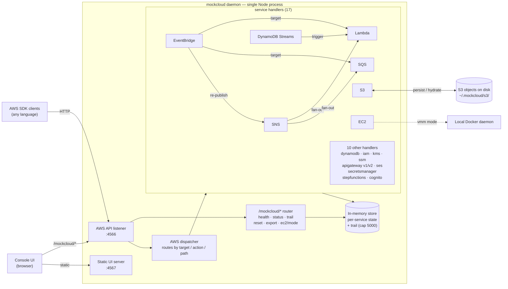

# ☁ MockCloud

**Free, open-source local AWS emulator. No account. No token. No credit card. MIT licensed.**

Run AWS services on your machine. Point your SDK at `localhost:4566` and go.

```bash
npx mockcloud          # coming soon
# or
git clone https://github.com/mockcloud/mockcloud
npm install && npm start
```

```
AWS API  →  http://127.0.0.1:4566
Console  →  http://127.0.0.1:4567
```

---

## Why MockCloud?

- **No AWS account needed** — dev and test completely offline
- **No Docker required** — works out of the box (Docker optional for EC2 VMM mode)
- **Visual console included** — browser UI to inspect every service
- **Cross-service wiring is real** — SNS → Lambda, EventBridge → SQS, DDB Streams → Lambda all actually fire
- **Free forever** — MIT license, no telemetry, no SaaS

---

## Supported Services

| Service | What works |
|---|---|
| **S3** | Buckets, objects, disk persistence, binary integrity, real ETags |
| **DynamoDB** | Tables, items, GSI, queries, scans, batch ops, transactions |
| **DynamoDB Streams** | INSERT/MODIFY/REMOVE events, Lambda triggers via event source mappings |
| **Lambda** | Create/invoke/delete, zip upload, real Node.js sandbox execution |
| **SQS** | Queues, send/receive/delete/purge, visibility timeout, real MD5 |
| **SNS** | Topics, subscriptions, fan-out to Lambda + SQS subscribers |
| **EventBridge** | Rules, targets, real fan-out to Lambda/SQS/SNS |
| **EC2** | RunInstances, stop/start/terminate (simulated or real Docker containers) |
| **IAM / STS** | Users, roles, policies, AssumeRole, GetCallerIdentity |
| **Secrets Manager** | Create/get/update/delete secrets |
| **SSM Parameter Store** | Put/get/delete parameters |
| **KMS** | Keys, encrypt/decrypt |
| **CloudWatch** | PutMetricData, GetMetricStatistics, ring-buffer storage |
| **SES** | Send emails, inbox viewer in console |
| **Step Functions** | State machines, executions, ASL interpreter |
| **Cognito** | User pools, users, auth flows |
| **API Gateway** | REST APIs, resources, methods, integrations |

---

## Quick Start

### npm (recommended)

```bash
npm install -g mockcloud   # coming soon
mockcloud
```
### Docker

```bash
# Simulated mode (default, no Docker needed)
docker pull ghcr.io/mockcloud/mockcloud:latest
docker run -p 4566:4566 -p 4567:4567 ghcr.io/mockcloud/mockcloud

# Docker VMM mode (real containers — mounts host Docker socket)
docker run -p 4566:4566 -p 4567:4567 \
  -v /var/run/docker.sock:/var/run/docker.sock \
  ghcr.io/mockcloud/mockcloud --ec2=docker
```

### From source

```bash
git clone https://github.com/mockcloud/mockcloud
cd mockcloud
npm install
npm run ui:build     # build the console UI
npm start            # start on :4566 (API) + :4567 (console)
```

---

## Connect Your SDK

### AWS CLI

```bash
export AWS_ENDPOINT_URL=http://127.0.0.1:4566
export AWS_ACCESS_KEY_ID=local
export AWS_SECRET_ACCESS_KEY=local
export AWS_DEFAULT_REGION=us-east-1

aws s3 mb s3://my-bucket
aws s3 cp ./file.txt s3://my-bucket/
aws dynamodb list-tables
aws sqs create-queue --queue-name my-queue
```

### AWS SDK (Node.js)

```js
import { S3Client, ListBucketsCommand } from "@aws-sdk/client-s3";

const s3 = new S3Client({
  endpoint: "http://127.0.0.1:4566",
  region: "us-east-1",
  credentials: { accessKeyId: "local", secretAccessKey: "local" },
  forcePathStyle: true,   // required for S3
});

await s3.send(new ListBucketsCommand({}));
```

### Terraform

```hcl
provider "aws" {
  access_key                  = "local"
  secret_key                  = "local"
  region                      = "us-east-1"
  skip_credentials_validation = true
  skip_metadata_api_check     = true
  skip_requesting_account_id  = true

  endpoints {
    s3       = "http://127.0.0.1:4566"
    dynamodb = "http://127.0.0.1:4566"
    lambda   = "http://127.0.0.1:4566"
    sqs      = "http://127.0.0.1:4566"
    sns      = "http://127.0.0.1:4566"
    iam      = "http://127.0.0.1:4566"
  }
}
```

---

## CLI Flags

```bash
node src/index.js --ec2=simulated   # EC2 simulated (default, no Docker needed)
node src/index.js --ec2=docker      # EC2 backed by real Docker containers
```

**EC2 auto-detect:** if no flag is passed and Docker is running, MockCloud uses Docker automatically. Otherwise falls back to simulated.

When running in Docker, VMM mode requires mounting the host socket:
-v /var/run/docker.sock:/var/run/docker.sock

---

## Environment Variables

| Variable | Default | Description |
|---|---|---|
| `PORT` | `4566` | AWS API port |
| `UI_PORT` | `4567` | Console UI port |
| `HOST` | `127.0.0.1` | Bind address (`0.0.0.0` for Docker) |

---

## Console UI

Open `http://127.0.0.1:4567` in your browser for a visual dashboard of every service — create/delete resources, inspect state, invoke Lambdas, peek SQS queues, view SES inbox, run Step Functions, and more.

---

## Storage

S3 objects persist to disk at `~/.mockcloud/s3/<bucket>/<key>` and survive restarts. Everything else is in-memory and resets on restart. EC2 in Docker mode reconciles container state across restarts via container labels.

---

## Architecture

MockCloud is a single Node process that runs two HTTP listeners. The `:4566` listener handles every AWS API call: it first tries the internal `/mockcloud/*` router (used by the console UI and tooling), then falls through to an AWS dispatcher that routes each call to one of 17 service handlers by `X-Amz-Target` header, `Action` parameter, or URL path. The `:4567` listener is a static file server for the prebuilt React console. All service state lives in a single in-memory `store`; S3 object bytes are additionally written to disk under `~/.mockcloud/s3/`, and EC2 in `vmm` mode delegates to the local Docker daemon.



Solid edges are synchronous HTTP requests or in-process calls (the cross-service fan-out arrows fire in-process via a shared `invokeLambda` / `enqueueMessage` helper); the dotted edge marks the optional Docker integration, active only when EC2 is in `vmm` mode.

### Source layout

```
src/
├── index.js          — HTTP servers, body draining, EC2 mode detection
├── dispatcher.js     — Routes AWS API calls to service handlers
├── router.js         — /mockcloud/* UI API router
├── store.js          — In-memory state, CloudWatch ring buffer
├── middleware/       — Response helpers (XML, JSON, body)
├── routes/           — UI API handlers (one per service)
└── services/         — AWS API handlers (one per service)
ui/
├── vite.config.js    — Proxies /mockcloud → :4566
└── src/
    ├── App.jsx       — Root, live service counts
    ├── api.js        — Fetch wrapper for all UI calls
    └── pages/        — One page per service
```

---

## Contributing

PRs welcome. Services are isolated — adding a new one means dropping a file in `src/services/` and `src/routes/` and registering it in `routes/index.js`.

```bash
git clone https://github.com/mockcloud/mockcloud
cd mockcloud
npm install
npm run dev        # API with --watch
# separate terminal:
npm run ui:dev     # Vite dev server with HMR
```

---

## License

MIT — do whatever you want with it.